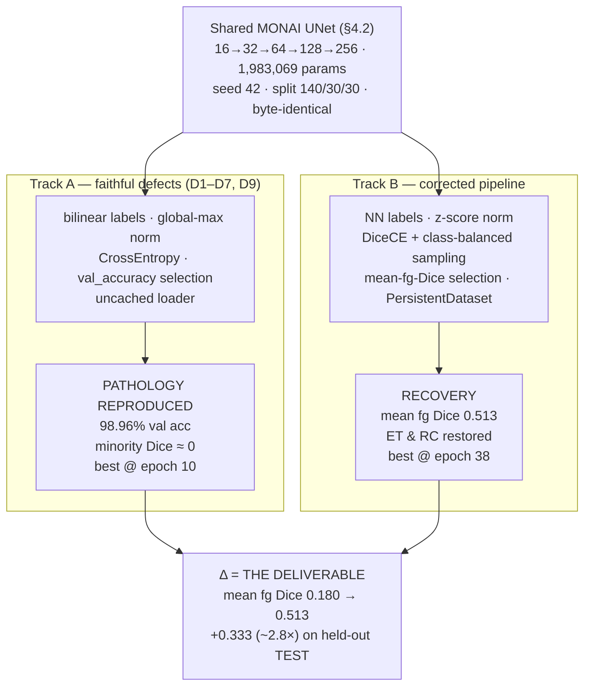
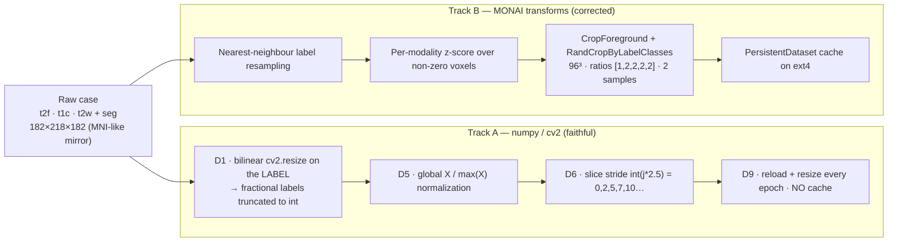
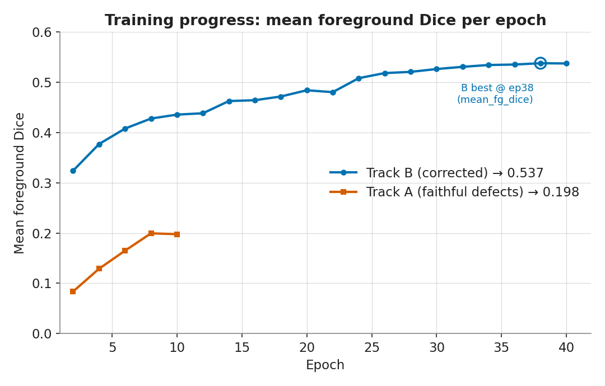
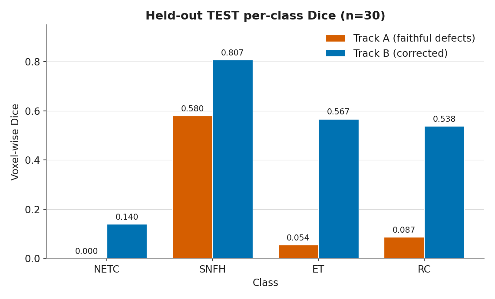
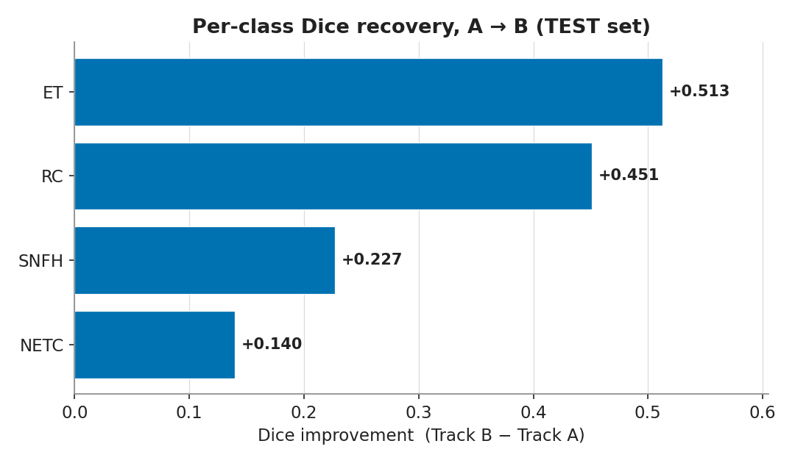
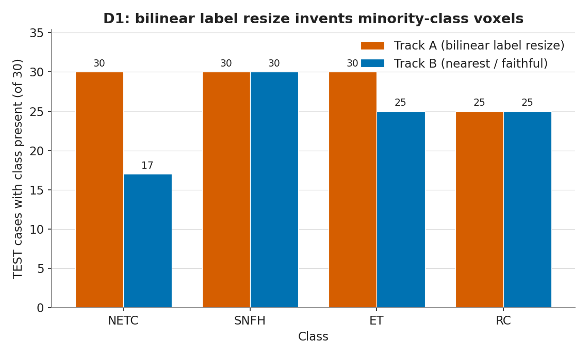
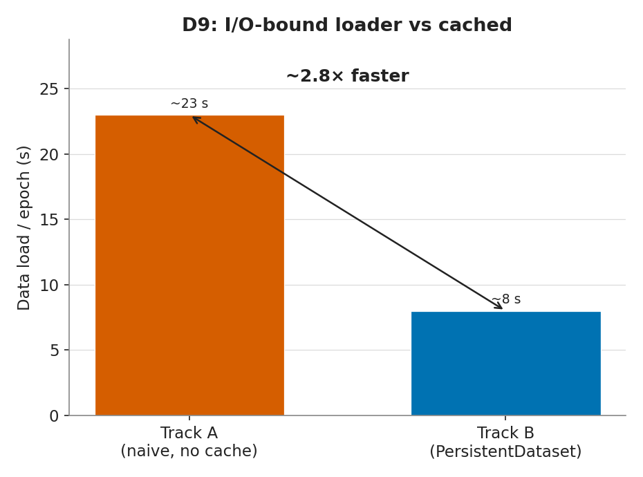
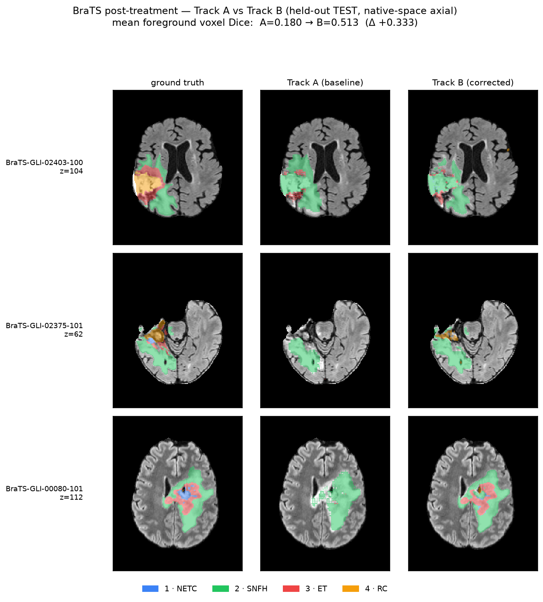

# Achievement Report — Post-Treatment Glioma Segmentation: A Controlled A/B on Pipeline Defects

**Task:** flat 5-class post-treatment BraTS-GLI 2024 segmentation (labels: 0 background,
1 NETC, 2 SNFH, 3 ET, 4 RC).
**Metric:** voxel-wise Dice — **not** BraTS lesion-wise; see [§5](#5-analysis--intuition--why-the-delta) and CLAUDE.md §14.3. Do not compare to challenge leaderboards.
**Model:** one shared MONAI `UNet` (`16→32→64→128→256`, **1,983,069 params**), byte-identical
across both tracks (§4.2). Seed 42; stratified split 140/30/30 (train/val/test).
All numbers below are recomputed from `reports/eval_{a,b}.json`, `reports/results.md`, and
`~/brats/runs/{a,b}/metrics.csv` (guardrail #9).

---

## 1. Executive summary

An earlier TensorFlow/Keras research pipeline for this task carried a family of nine named
defects (D1–D9) — a bilinear resize applied to *label* volumes, class imbalance left
entirely unhandled, checkpoints selected on a degenerate accuracy metric, and an
uncached loader that starves the GPU. This project reimplements the pipeline in modern
PyTorch + MONAI as a **controlled A/B experiment**:

- **Track A** faithfully *reproduces* the defects and is expected to reproduce the
  pathology — high pixel accuracy, minority-class Dice pinned near zero.
- **Track B** *fixes* the defects while holding the network architecture byte-identical,
  so any change is attributable to the pipeline, not the model.

The deliverable is not a leaderboard score — it is the **A→B delta**, which is immune to
the project's deliberate handicaps (small data, tiny model, no ensembling) because both
tracks carry them equally.

> ### Headline
> **Mean foreground Dice `0.180 → 0.513` on the held-out TEST set — Δ = +0.333, ≈2.8×.**
> Largest recovery on **ET (+0.513)** and **RC (+0.451)**. Track A behaves exactly as a
> faithful baseline should: **98.96% validation voxel accuracy with minority-class Dice
> near zero** — a Track A that scored well would mean the reproduction was wrong
> (guardrail #5). NETC stays the hardest class even after the fix, because it is both
> small and rare (GT-present in only 17/30 test cases; ~52% of the dataset).

---

## 2. Experimental design (A/B)

One network, held constant. Only the data pipeline, loss, and model-selection metric
differ — that is the whole reason the comparison is credible.

---

## 3. Data pipeline — Track A vs Track B

The delta lives entirely in these two chains. Track A is the original's numpy/`cv2` path;
Track B is a principled MONAI transform stack.

**Read the contrast this way:** Track A can *invent or destroy labels* (D1), *coasts on
background* (global norm + plain CE, no class balancing), and *starves the GPU* (no
cache). Track B keeps labels integral (nearest-neighbour), normalizes per modality, forces
the sampler to visit every foreground class, and caches — so the same network finally
sees a balanced, uncorrupted signal.

---

## 4. Results

### 4.1 Held-out TEST set — per-class Dice (n_test = 30)

Source: `reports/eval_a.json`, `reports/eval_b.json`. `n GT-present` = number of test
cases in which that class actually occurs, reported **alongside** every Dice (guardrail #4)
because Track A's counts are themselves a finding (§5.2).

| Class | Track A | Track B | Δ (B−A) | n GT-present (A / B) |
|---|---|---|---|---|
| NETC (1) | 0.000 | 0.140 | **+0.140** | 30 / 17 |
| SNFH (2) | 0.580 | 0.807 | **+0.227** | 30 / 30 |
| ET (3)   | 0.054 | 0.567 | **+0.513** | 30 / 25 |
| RC (4)   | 0.087 | 0.538 | **+0.451** | 25 / 25 |
| **Mean foreground** | **0.180** | **0.513** | **+0.333** | |

### 4.2 Validation set — per-class Dice (each track at its own best epoch)

Source: `~/brats/runs/{a,b}/metrics.csv` (Track A @ epoch 10, Track B @ epoch 38).

| Class | Track A | Track B | Δ (B−A) |
|---|---|---|---|
| NETC | 0.000 | 0.162 | +0.162 |
| SNFH | 0.615 | 0.794 | +0.179 |
| ET   | 0.036 | 0.572 | +0.536 |
| RC   | 0.140 | 0.624 | +0.484 |
| **Mean foreground** | **0.198** | **0.538** | **+0.340** |

**Validation voxel accuracy: A 0.9896 / B 0.9924** — degenerate (~98% of voxels are
background). This is precisely the D4 motivation, so it is *not* a headline; it is the
metric a faithful baseline is supposed to be fooled by. Track A checkpoints on this
degenerate `val_accuracy` (peaks @ epoch 10); Track B checkpoints on **mean foreground
Dice** (peaks @ epoch 38).

### 4.3 Figures

**Training curves — the two selection metrics diverge.** Track A's `val_accuracy` saturates
near 0.99 while its foreground Dice never leaves the floor; Track B climbs steadily on
mean-foreground Dice to epoch 38.

**Per-class TEST Dice.** The minority classes (ET, RC, NETC) are where the recovery lives;
SNFH was learnable all along and improves modestly.

**The delta, per class.** ET (+0.513) and RC (+0.451) dominate the deliverable.

**Count inflation (defect D1, measured directly).** Track A reports NETC and ET present in
**30/30** test cases; the faithful nearest-neighbour labels show **17** and **25**. The gap
is fabricated minority-class voxels created by bilinear interpolation across class
boundaries.

**D9 — I/O-bound loader vs cache.** Track A's naive loader spends ~23 s/epoch on data I/O
against ~5 s of compute; Track B's `PersistentDataset` cuts data loading to ~8 s
(warm) — a ~2.8× data-loading speedup on identical hardware.

**Qualitative overlays — three held-out TEST cases.** Columns are **ground truth / Track A /
Track B** (axial slices; NETC blue, SNFH green, ET red, RC amber). Track A predicts
essentially only SNFH — **zero RC, zero NETC** — the minority-class collapse. Track B
recovers ET and RC in spatial agreement with GT.

Display note: the tracks infer in different geometries (A: warped 128²×48; B:
foreground-cropped RAS via sliding window) and are resampled to a common array space for
viewing. Inference is faithful; only the display is resampled.

---

## 5. Analysis & intuition — why the delta

### 5.1 Per-class reasoning

- **ET (+0.513) and RC (+0.451) recover the most.** In Track A, background is ~98% of
  voxels and plain CrossEntropy plus a single global-max normalization let the network
  *coast*: predicting "background almost everywhere, plus a blob of SNFH" already scores
  98.96% pixel accuracy, so there is no gradient pressure to find small enhancing tumour
  (ET) or resection cavities (RC). Track B removes both escape hatches at once — **DiceCE
  with `include_background=False`** makes the loss care about foreground overlap directly,
  and **`RandCropByLabelClasses` with ratios `[1,2,2,2,2]`** guarantees the model is shown
  patches centred on every foreground class, over-sampling the rare ones. The classes that
  were being *ignored* are exactly the classes that jump.
- **SNFH (+0.227) was always learnable.** It is present in 30/30 cases and is the largest,
  most contiguous foreground structure, so even the coasting Track A reaches Dice 0.580.
  Track B lifts it to 0.807 — a real but smaller gain, because there was no collapse to
  reverse here, only refinement.
- **NETC stays hardest (Dice 0.140, +0.140).** It is *both small and rare*: GT-present in
  only **17/30** test cases and in ~**52% (105/200)** of the whole dataset (from
  `reports/labels_summary.json`). Class-balanced sampling cannot manufacture signal that is
  absent from half the volumes, and necrotic tissue is genuinely confusable with the
  resection cavity. A partial recovery from exactly 0.000 to 0.140 is the honest ceiling
  for this class at this data scale.

### 5.2 The D1 finding — bilinear resize *invents* labels (measured, not asserted)

Track A resizes the label volume with `cv2.resize` (default `INTER_LINEAR`) and truncates
to int. Interpolating across a class boundary produces fractional label values that round
into a *different* class. The per-class case counts expose the damage directly: Track A
reports **NETC in 30/30** and **ET in 30/30** test cases, but the faithful nearest-neighbour
labels show only **17** and **25**. Those extra "present" cases are fabricated voxels — the
"can invent/destroy labels" harm named in the defect inventory (D1), quantified. This is
why per-class Dice is **never** reported without its case count.

### 5.3 The D9 story — the original was benchmarking gzip, not the GPU

Track A keeps the uncached loader that re-reads gzipped NIfTI volumes and runs the resize
stack **every step, every epoch**: ~23 s/epoch of data I/O against ~5 s of compute — it is
I/O-bound, and the GPU sits idle waiting. Track B's `PersistentDataset` caches the
preprocessed tensors on ext4, dropping data loading to ~8 s (warm) — a **~2.8×
data-loading speedup** on the same GPU. The speedup is deliberately less dramatic than the
original's datacenter figures because our data is small and the OS page cache already
absorbs much of it — stated honestly rather than inflated.

### 5.4 The D7 discrepancy — the committed reference is *4-class*

The spec's narrative (§3/D7) describes a vestigial `Y[Y==5] = 4` remap left over from a
BraTS-2020 tutorial. The **actually committed** reference
(`reference/Model/.../unet_cc.py`, lines 144–145) is worse: it runs `Y[Y==4] = 3` and
`tf.one_hot(Y, 4)` — i.e. it **merges RC (4) into ET (3) and one-hot-encodes only four
classes**, silently destroying the resection-cavity class on 2024 post-treatment data. Our
pipeline is deliberately **5-class** on both tracks: Track A is the *5-class faithful
baseline* and does not replicate the reference's RC-merging, because doing so would erase
the very class this project exists to measure. This is documented, not papered over.

### 5.5 Honest limitations

- **Voxel-wise, not lesion-wise Dice.** BraTS 2024 scores lesion-wise Dice + Hausdorff-95
  per connected component. Ours is plain voxel-wise Dice — correct and internally
  consistent for an A/B, but a *different number on identical predictions*. **Never**
  compared to leaderboards here.
- **~200 cases, a ~2M-param plain U-Net.** No test-time augmentation, no ensembling, ~10/40
  epochs, 3 channels, 8 GB laptop GPU. Per the SOTA-handicap discussion (§2.3), **low
  absolute numbers are by design** — the A→B delta carries the identical handicap on both
  sides, so the delta, not the absolute Dice, is the result.
- **Partial community mirror in MNI-like space.** Data is a 200-case subsample of a Kaggle
  re-upload (~700 of ~1,350 official cases), **resampled to 182×218×182**, not the native
  BraTS 240×240×155. Cite the BraTS 2024 challenge (de Verdier et al., arXiv:2405.18368),
  not the mirror. Exact IDs and the dataset hash: `reports/splits.json`,
  `reports/data_provenance.json`.
- **Flat 5-class ≠ pre-op merged regions.** A pre-op paper's "WT Dice 0.90" and our "SNFH
  Dice 0.807" are not on speaking terms.

---

## 6. Defect → fix → evidence ladder (D1–D9)

| # | Defect (Track A reproduces) | Fix (Track B) | Evidence in this report |
|---|---|---|---|
| **D1** | Bilinear `cv2.resize` on the label volume — invents/destroys labels | Nearest-neighbour label resampling | Count inflation: NETC 30→17, ET 30→25 (§4.1, §5.2, `count_inflation.png`) |
| **D2** | Per-class Dice shape bug (4-index vs 5-index) — original logs untrustworthy | Correct indexing via MONAI `DiceMetric` | All Dice here computed with fixed metric (§4.1) |
| **D3** | Class imbalance unhandled; plain CE coasts on background | `DiceCELoss(include_background=False)` + class-balanced sampling | ET +0.513, RC +0.451 (§4.1, §5.1, `delta_test.png`) |
| **D4** | Checkpoint selected on degenerate `val_accuracy` | Select on mean foreground Dice | A best @ ep10 vs B best @ ep38 (§4.2, `training_curves.png`) |
| **D5** | Crude global `X / max(X)` normalization | Per-modality z-score over non-zero voxels | Contributes to the mean-fg delta (§3, §4.1) |
| **D6** | Non-uniform slice stride `int(j*2.5)` | Foreground crop + `RandCropByLabelClasses` 96³ | Part of Track B pipeline (§3) |
| **D7** | Dead 4-class remap merges RC→ET (label-contract fork) | Explicit 5-class contract asserted at load | 5-class throughout; RC kept & measured (§5.4) |
| **D8** | No normalization layers in the net | **Held constant across tracks** (not part of the A/B, §4.2) | Architecture byte-identical (§2) |
| **D9** | Uncached, I/O-bound loader starves the GPU | `PersistentDataset` cache | ~23 s → ~8 s data load, ~2.8× (§4.3, §5.3, `d9_speed.png`) |

---

## 7. Reproduce

Full build spec, hard constraints, the complete defect inventory, phase gates, and
guardrails live in **[CLAUDE.md](CLAUDE.md)** (authoritative). Environment setup, the
exact command sequence (fetch → smoke-test → train A/B → evaluate), and where every
artifact lives are in **[README.md](README.md#reproduce)**.

- **Sources of truth (committed):** `reports/results.md`, `reports/eval_{a,b}.json`,
  `reports/splits.json`, `reports/data_provenance.json`, `reports/labels_summary.json`.
- **Run logs:** `~/brats/runs/{a,b}/metrics.csv`, `meta.json`, TensorBoard events (copied
  into `reports/runs/{a,b}/`).
- **Figures:** regenerate with `scripts/05_figures.py`.

*Every number in this report traces to a committed run log (guardrail #9). Voxel-wise Dice
only — no leaderboard comparisons (§14.3).*
