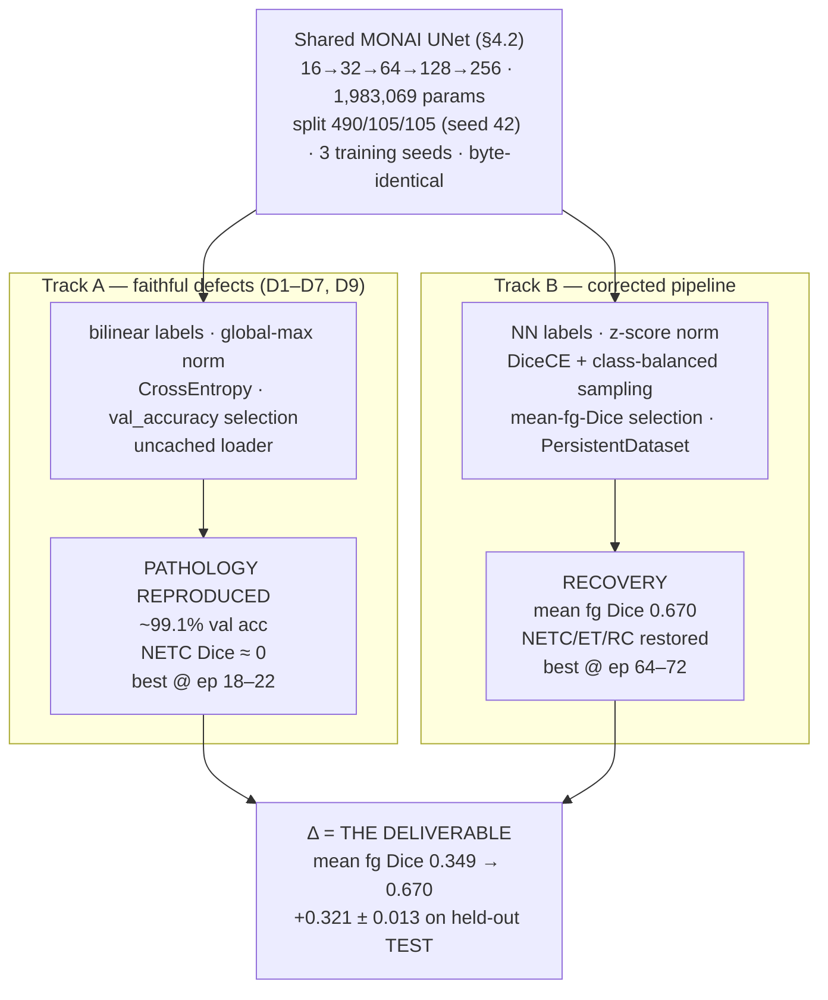
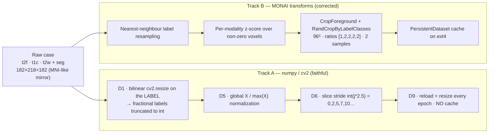
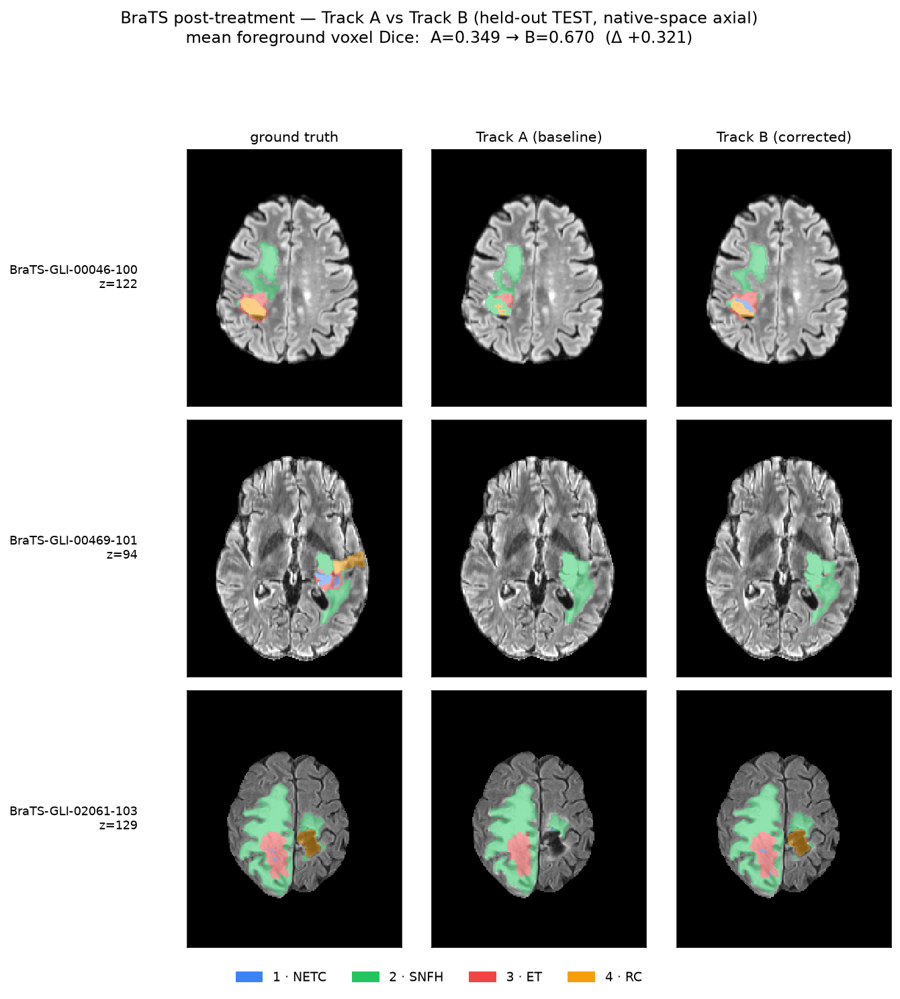

# Achievement Report — Post-Treatment Glioma Segmentation: A Controlled A/B on Pipeline Defects

**Task:** flat 5-class post-treatment BraTS-GLI 2024 segmentation (labels: 0 background,
1 NETC, 2 SNFH, 3 ET, 4 RC).
**Metric:** voxel-wise Dice — **not** BraTS lesion-wise; see [§5](#5-analysis--intuition--why-the-delta) and CLAUDE.md §14.3. Do not compare to challenge leaderboards.
**Model:** one shared MONAI `UNet` (`16→32→64→128→256`, **1,983,069 params**), byte-identical
across both tracks (§4.2). **700 cases**; split fixed at seed 42 (**490/105/105** train/val/test,
stratified by RC); each track trained on **3 seeds {0,1,2}**, so every number below is **mean ± SD
over 3 runs** on one shared test set. Recomputed from `reports/eval_{a,b}_s{0,1,2}.json`,
`reports/results_700_seeds.json`, and `~/brats/runs/{a,b}_s{0,1,2}/metrics.csv` (guardrail #9).

---

## 1. Executive summary

An earlier TensorFlow/Keras research pipeline for this task carried a family of nine named
defects (D1–D9) — a bilinear resize applied to *label* volumes, class imbalance left
entirely unhandled, checkpoints selected on a degenerate accuracy metric, and an
uncached loader that starves the GPU. This project reimplements the pipeline in modern
PyTorch + MONAI as a **controlled A/B experiment**:

- **Track A** faithfully *reproduces* the defects and is expected to reproduce the
  pathology — high pixel accuracy, minority-class Dice pinned near zero.
- **Track B** *fixes* the defects while holding the network architecture byte-identical,
  so any change is attributable to the pipeline, not the model.

The deliverable is not a leaderboard score — it is the **A→B delta**, which is immune to
the project's deliberate handicaps (small data, tiny model, no ensembling) because both
tracks carry them equally.

> ### Headline
> **Mean foreground Dice `0.349 → 0.670` on the held-out TEST set — Δ = +0.321 ± 0.013, ≈1.9×**
> (mean ± SD over 3 seeds, n_test = 105). Largest recovery on the **rarest class, NETC
> (+0.457)**, then ET (+0.351) and RC (+0.291); the tiny per-seed SD (Track B ±0.002–0.007)
> makes this a stable effect, not a lucky run. Track A behaves exactly as a faithful baseline
> should: **~99.1% validation voxel accuracy with the rare class pinned near zero (NETC 0.009)**
> — a Track A that scored well would mean the reproduction was wrong (guardrail #5). The absolute
> delta reproduces the 200-case pilot's +0.333 *with error bars*; the ratio fell from ~2.8× only
> because more data lets even the **defective** Track A learn the prevalent classes (§5.1).

---

## 2. Experimental design (A/B)

One network, held constant. Only the data pipeline, loss, and model-selection metric
differ — that is the whole reason the comparison is credible.

---

## 3. Data pipeline — Track A vs Track B

The delta lives entirely in these two chains. Track A is the original's numpy/`cv2` path;
Track B is a principled MONAI transform stack.

**Read the contrast this way:** Track A can *invent or destroy labels* (D1), *coasts on
background* (global norm + plain CE, no class balancing), and *starves the GPU* (no
cache). Track B keeps labels integral (nearest-neighbour), normalizes per modality, forces
the sampler to visit every foreground class, and caches — so the same network finally
sees a balanced, uncorrupted signal.

---

## 4. Results

### 4.1 Held-out TEST set — per-class Dice (n_test = 105, mean ± SD over 3 seeds)

Source: `reports/eval_{a,b}_s{0,1,2}.json`, aggregated in `reports/results_700_seeds.json`.
`n GT-present` = number of test cases in which that class actually occurs, reported
**alongside** every Dice (guardrail #4) because Track A's counts are themselves a finding (§5.2).

| Class | Track A | Track B | Δ (B−A) | n GT-present (A / B) |
|---|---|---|---|---|
| NETC (1) | 0.009 ± 0.008 | 0.466 ± 0.004 | **+0.457** | 105 / 48 |
| SNFH (2) | 0.683 ± 0.017 | 0.870 ± 0.003 | **+0.187** | 105 / 105 |
| ET (3)   | 0.299 ± 0.033 | 0.650 ± 0.007 | **+0.351** | 100 / 85 |
| RC (4)   | 0.403 ± 0.026 | 0.694 ± 0.002 | **+0.291** | 87 / 87 |
| **Mean foreground** | **0.349 ± 0.013** | **0.670 ± 0.002** | **+0.321 ± 0.013** | |

### 4.2 Validation set — per-class Dice (mean ± SD, each track at its own best epoch)

Source: `~/brats/runs/{a,b}_s{0,1,2}/metrics.csv` (Track A @ epochs 18–22, Track B @ epochs 64–72).

| Class | Track A | Track B | Δ (B−A) |
|---|---|---|---|
| NETC | 0.007 ± 0.004 | 0.545 ± 0.009 | +0.538 |
| SNFH | 0.674 ± 0.014 | 0.856 ± 0.003 | +0.182 |
| ET   | 0.261 ± 0.022 | 0.653 ± 0.010 | +0.392 |
| RC   | 0.337 ± 0.017 | 0.674 ± 0.003 | +0.337 |
| **Mean foreground** | **0.320 ± 0.008** | **0.682 ± 0.003** | **+0.362** |

**Validation voxel accuracy: A 0.991 / B 0.995** — degenerate (~98%+ of voxels are
background). This is precisely the D4 motivation, so it is *not* a headline; it is the
metric a faithful baseline is supposed to be fooled by. Track A checkpoints on this
degenerate `val_accuracy` (peaks @ epochs 18–22); Track B checkpoints on **mean foreground
Dice** (peaks @ epochs 64–72).

### 4.3 Figures

**Training curves — the two selection metrics diverge (mean ± SD band over 3 seeds).** Track A's
mean-foreground Dice plateaus low while Track B climbs steadily to ~0.68; the shaded band is the
per-seed SD, tight throughout.

**Per-class TEST Dice (mean ± SD).** Every class recovers; the rarest, NETC, jumps furthest —
error bars (per-seed SD) are small enough to see the gaps are real.

**The delta, per class.** NETC (+0.457) leads, then ET (+0.351) and RC (+0.291) — the rare/minority
classes dominate the deliverable; SNFH (+0.187) refines.

**Count inflation (defect D1, measured directly).** Track A reports NETC present in **105/105**
test cases and ET in **100/105**; the faithful nearest-neighbour labels show only **48** and **85**.
The gap is fabricated minority-class voxels created by bilinear interpolation across class
boundaries — even starker at scale than the pilot's 30-vs-17.

**D9 — I/O-bound loader vs cache.** Track A's naive loader spends ~23 s/epoch on data I/O
against ~5 s of compute; Track B's `PersistentDataset` cuts data loading to ~8 s
(warm) — a ~2.8× data-loading speedup on identical hardware.

**Qualitative overlays — three held-out TEST cases** (all four classes present; regenerated from
the scaled `a_s0`/`b_s0` checkpoints). Columns are **ground truth / Track A / Track B** (axial
slices; NETC blue, SNFH green, ET red, RC amber). Track A captures SNFH and much of ET but
**misses the rare NETC (blue) and RC (amber)** — visible in rows 2–3; Track B recovers them in
spatial agreement with GT, which is the minority-class recovery the delta measures.

**Three more held-out cases**, same layout — again Track A drops the rare RC (amber) and NETC
(blue), which Track B recovers (in case `00469` Track A predicts only SNFH and misses the RC
entirely):

Display note: the tracks infer in different geometries (A: warped 128²×48; B:
foreground-cropped RAS via sliding window) and are resampled to a common array space for
viewing. Inference is faithful; only the display is resampled.

---

## 5. Analysis & intuition — why the delta

### 5.1 Per-class reasoning

- **NETC (+0.457) recovers the most — the rarest class.** In Track A, background is ~98% of
  voxels and plain CrossEntropy plus a single global-max normalization let the network *coast*:
  predicting "background almost everywhere, plus the easy structures" already scores ~99% pixel
  accuracy, so there is no gradient pressure to find the small necrotic core — Track A's NETC Dice
  is essentially zero (0.009). Track B removes both escape hatches at once — **DiceCE with
  `include_background=False`** makes the loss care about foreground overlap directly, and
  **`RandCropByLabelClasses` with ratios `[1,2,2,2,2]`** guarantees the model is shown patches
  centred on every foreground class, over-sampling the rare ones. NETC leaps to 0.466 — the class
  that was being *ignored* is exactly the class that jumps furthest.
- **ET (+0.351) and RC (+0.291) recover strongly.** Both are prevalent in this cohort (GT-present
  in ~83% of cases), so even the defective Track A partly learns them (ET 0.299, RC 0.403) once it
  has 490 training cases — but Track B's balanced sampling and Dice loss still add a large margin
  (ET → 0.650, RC → 0.694).
- **SNFH (+0.187) was always learnable.** Present in 105/105 cases and the largest, most contiguous
  foreground structure, so even the coasting Track A reaches Dice 0.683; Track B refines it to
  0.870 — a real but smaller gain, because there was no collapse to reverse here.
- **The scale effect (vs the 200-case pilot).** At 140 training cases Track A was data-starved and
  collapsed on *everything* (mean_fg 0.180); at 490 it recovers the prevalent classes and rises to
  0.349, while Track B rose further (0.513 → 0.670). So the absolute A→B delta held (+0.333 →
  +0.321) even as the ratio fell (~2.8× → ~1.9×), and the effect **sharpened onto the genuinely
  rare class**. NETC stays the lowest absolute Dice in both tracks (B 0.466) — small, and
  confusable with the resection cavity — so +0.457 is a large but honest recovery, not a solved
  class.

### 5.2 The D1 finding — bilinear resize *invents* labels (measured, not asserted)

Track A resizes the label volume with `cv2.resize` (default `INTER_LINEAR`) and truncates
to int. Interpolating across a class boundary produces fractional label values that round
into a *different* class. The per-class case counts expose the damage directly: Track A
reports **NETC in 105/105** and **ET in 100/105** test cases, but the faithful nearest-neighbour
labels show only **48** and **85**. Those extra "present" cases are fabricated voxels — the
"can invent/destroy labels" harm named in the defect inventory (D1), quantified (and more
starkly than the pilot's 30-vs-17). This is why per-class Dice is **never** reported without its
case count.

### 5.3 The D9 story — the original was benchmarking gzip, not the GPU

Track A keeps the uncached loader that re-reads gzipped NIfTI volumes and runs the resize
stack **every step, every epoch**: ~23 s/epoch of data I/O against ~5 s of compute — it is
I/O-bound, and the GPU sits idle waiting. Track B's `PersistentDataset` caches the
preprocessed tensors on ext4, dropping data loading to ~8 s (warm) — a **~2.8×
data-loading speedup** on the same GPU. The speedup is deliberately less dramatic than the
original's datacenter figures because our data is small and the OS page cache already
absorbs much of it — stated honestly rather than inflated.

### 5.4 The D7 discrepancy — the committed reference is *4-class*

The spec's narrative (§3/D7) describes a vestigial `Y[Y==5] = 4` remap left over from a
BraTS-2020 tutorial. The **actually committed** reference
(`reference/Model/.../unet_cc.py`, lines 144–145) is worse: it runs `Y[Y==4] = 3` and
`tf.one_hot(Y, 4)` — i.e. it **merges RC (4) into ET (3) and one-hot-encodes only four
classes**, silently destroying the resection-cavity class on 2024 post-treatment data. Our
pipeline is deliberately **5-class** on both tracks: Track A is the *5-class faithful
baseline* and does not replicate the reference's RC-merging, because doing so would erase
the very class this project exists to measure. This is documented, not papered over.

### 5.5 Honest limitations

- **Voxel-wise, not lesion-wise Dice.** BraTS 2024 scores lesion-wise Dice + Hausdorff-95
  per connected component. Ours is plain voxel-wise Dice — correct and internally
  consistent for an A/B, but a *different number on identical predictions*. **Never**
  compared to leaderboards here.
- **700 cases (490 train), a ~2M-param plain U-Net.** No test-time augmentation, no ensembling,
  25/80 epochs, 3 channels, 8 GB laptop GPU. Per the SOTA-handicap discussion (§2.3), **low
  absolute numbers are by design** — the A→B delta carries the identical handicap on both sides,
  so the delta, not the absolute Dice, is the result.
- **Community mirror in MNI-like space.** Data is the full 700-case Kaggle re-upload (~700 of
  ~1,350 official cases), **resampled to 182×218×182**, not the native BraTS 240×240×155. Cite the
  BraTS 2024 challenge (de Verdier et al., arXiv:2405.18368), not the mirror. Exact IDs and the
  dataset hash: `reports/splits.json`, `reports/data_provenance.json`.
- **Flat 5-class ≠ pre-op merged regions.** A pre-op paper's "WT Dice 0.90" and our "SNFH
  Dice 0.870" are not on speaking terms.

---

## 6. Defect → fix → evidence ladder (D1–D9)

| # | Defect (Track A reproduces) | Fix (Track B) | Evidence in this report |
|---|---|---|---|
| **D1** | Bilinear `cv2.resize` on the label volume — invents/destroys labels | Nearest-neighbour label resampling | Count inflation: NETC 105→48, ET 100→85 (§4.1, §5.2, `count_inflation.png`) |
| **D2** | Per-class Dice shape bug (4-index vs 5-index) — original logs untrustworthy | Correct indexing via MONAI `DiceMetric` | All Dice here computed with fixed metric (§4.1) |
| **D3** | Class imbalance unhandled; plain CE coasts on background | `DiceCELoss(include_background=False)` + class-balanced sampling | NETC +0.457, ET +0.351, RC +0.291 (§4.1, §5.1, `delta_test.png`) |
| **D4** | Checkpoint selected on degenerate `val_accuracy` | Select on mean foreground Dice | A best @ ep 18–22 vs B best @ ep 64–72 (§4.2, `training_curves.png`) |
| **D5** | Crude global `X / max(X)` normalization | Per-modality z-score over non-zero voxels | Contributes to the mean-fg delta (§3, §4.1) |
| **D6** | Non-uniform slice stride `int(j*2.5)` | Foreground crop + `RandCropByLabelClasses` 96³ | Part of Track B pipeline (§3) |
| **D7** | Dead 4-class remap merges RC→ET (label-contract fork) | Explicit 5-class contract asserted at load | 5-class throughout; RC kept & measured (§5.4) |
| **D8** | *Reference* net had no normalization layers | Instance norm (MONAI default) on **both** tracks — not an A/B knob (§4.2) | Architecture byte-identical (§2) |
| **D9** | Uncached, I/O-bound loader starves the GPU | `PersistentDataset` cache | ~23 s → ~8 s data load, ~2.8× (§4.3, §5.3, `d9_speed.png`) |

---

## 7. Reproduce

Full build spec, hard constraints, the complete defect inventory, phase gates, and
guardrails live in **[CLAUDE.md](CLAUDE.md)** (authoritative). Environment setup, the
exact command sequence (fetch → smoke-test → train A/B → evaluate), and where every
artifact lives are in **[README.md](README.md#reproduce)**.

- **Sources of truth (committed):** `reports/results.md`, `reports/results_700_seeds.json`,
  `reports/eval_{a,b}_s{0,1,2}.json`, `reports/splits.json`, `reports/data_provenance.json`,
  `reports/labels_summary.json`.
- **Run logs:** `~/brats/runs/{a,b}_s{0,1,2}/metrics.csv`, `meta.json`, TensorBoard events.
- **Figures:** regenerate the analysis plots with `scripts/06_report_figures.py` and the
  qualitative overlays with `scripts/05_figures.py`.

*Every number in this report traces to a committed run log (guardrail #9). Voxel-wise Dice
only — no leaderboard comparisons (§14.3).*
